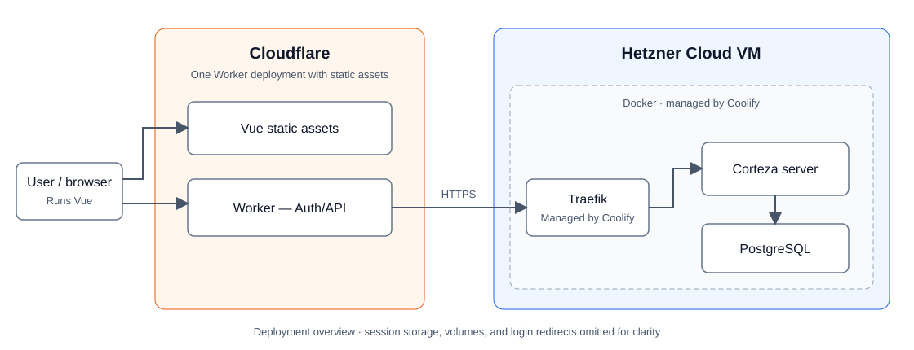

# Plexys Homework

Vue 3 with the Composition API, Corteza, and PostgreSQL. The Vue app uses an authentication/API server to sign users in with Corteza and save tickets under their permissions.

## Architecture



Cloudflare hosts the Vue static assets and the authentication/API Worker in one deployment. The Worker connects to Corteza through Traefik, managed by Coolify on a Hetzner Cloud VM. Corteza and PostgreSQL run using the backend Compose configuration.

[Original Draw.io diagram](docs/corteza-architecture.drawio)

## Prerequisites

- Node.js 22.18 or newer and npm.
- Docker Engine with Docker Compose v2 for the local Corteza/PostgreSQL backend.
- Two terminals: one for backend commands and one for the frontend development server.

Commands below assume the repository is at `~/plexys-homework`.

## Quick demo

To explore the UI with temporary sample data, without starting Docker or configuring Corteza:

```bash
cd ~/plexys-homework/plexys-vue-ui
npm ci
npm run demo
```

Open **http://localhost:5173** and click **Explore the demo**. Changes disappear when the demo stops. Stop it with `Ctrl+C` before running the real application on the same ports.

## Run locally with Corteza and PostgreSQL

### 1. Start the backend

In the first terminal:

```bash
cd ~/plexys-homework/plexys-corteza-backend
test -f .env || cp .env.example .env
```

Edit `plexys-corteza-backend/.env` with these settings. Preserve existing credentials if you already have a database:

```dotenv
VERSION=2024.9.10
DOMAIN=localhost:18080
EXPOSE_PORT=18080
POSTGRES_USER=postgres
POSTGRES_PASSWORD=YOUR_DATABASE_PASSWORD
AUTH_JWT_SECRET=YOUR_JWT_SECRET
```

For a new installation, run `openssl rand -hex 32` twice and use a different output for each secret. `EXPOSE_PORT` is required by the current Compose configuration. If you change it, also change `DOMAIN` and the UI's `CORTEZA_URL` to match.

Start the containers:

```bash
docker compose config --quiet
docker compose up -d
docker compose ps
docker compose logs --tail=100 server db
```

Open **http://localhost:18080** once Corteza has finished starting. Complete account setup if this is a fresh installation. PostgreSQL and Corteza data are stored in named Docker volumes.

### 2. Configure Corteza once

If your namespace, modules, and OAuth client already exist, reuse them.

In Compose, create a namespace and a Support Ticket module with these exact, case-sensitive technical field names:

| Field name | Type | Required | Values |
| --- | --- | --- | --- |
| `Subject` | String | Yes | Single line |
| `Description` | String | No | Multiple lines |
| `Status` | Select | Yes | `New`, `In Progress`, `Resolved`, `Closed` |
| `Priority` | Select | Yes | `Low`, `Medium`, `High`, `Urgent` |
| `DueDate` | Date and time | No | Date and time enabled |
| `Customer` | Record | No | Optional reference to the Customer module |

For select fields, use the listed text as both the option value and label. Disable multiple values. If using customers, create a Customer module with `name` and `email` fields, and point the ticket's `Customer` field to it. Otherwise, omit the customer field and leave `CORTEZA_CUSTOMER_MODULE_ID` empty below.

Copy the numeric namespace and module IDs from the Compose builder URLs.

In **Corteza Admin → System → Auth clients**, create or update an OAuth client with:

- Grant type: **Authorization code** / authenticate users.
- Redirect URI: **`http://localhost:5173/auth/callback`**.
- Scopes: **`profile api`**.

Copy its client ID and secret. The user signing in needs permission to read, create, and update ticket records, and read customers if enabled. Keep your production callback registered too if sharing the client with the deployed app.

### 3. Configure and start the UI

In the second terminal:

```bash
cd ~/plexys-homework/plexys-vue-ui
npm ci
test -f .env || cp .env.example .env
```

Edit `plexys-vue-ui/.env`:

```dotenv
APP_ORIGIN=http://localhost:5173
CORTEZA_URL=http://localhost:18080
PORT=3001
HOST=127.0.0.1
CORTEZA_CLIENT_ID=YOUR_CLIENT_ID
CORTEZA_CLIENT_SECRET=YOUR_CLIENT_SECRET
CORTEZA_NAMESPACE_ID=YOUR_NAMESPACE_ID
CORTEZA_TICKET_MODULE_ID=YOUR_TICKET_MODULE_ID
CORTEZA_CUSTOMER_MODULE_ID=
```

Set the optional customer module ID if using customers. Use numeric IDs, not module names. Keep both `.env` files private; the client secret must not have a `VITE_` prefix.

```bash
npm run dev
```

This starts Vue/Vite on port **5173** and the Node authentication/API server on port **3001**. You do not need to run `npm start` separately.

Open **http://localhost:5173**, click **Sign in with Corteza**, and finish authentication. Use `localhost` consistently so the browser origin and OAuth callback match. Create a ticket, refresh the page, and verify it in Corteza Compose.

To use an existing remote Corteza instance, skip the local backend step and set `CORTEZA_URL` to its HTTPS URL. Keep the local `APP_ORIGIN` and callback above.

## Start again after setup

```bash
cd ~/plexys-homework/plexys-corteza-backend
docker compose up -d
cd ../plexys-vue-ui
npm run dev
```

Open **http://localhost:5173**. Restart `npm run dev` after editing the UI's `.env`.

## Stop the application

Press `Ctrl+C` in the UI terminal, then stop the backend:

```bash
cd ~/plexys-homework/plexys-corteza-backend
docker compose stop
```

This keeps database contents. `docker compose down -v` removes the data volumes, so do not use it when you want to keep tickets.

## Troubleshooting

| Symptom | Check |
| --- | --- |
| Corteza does not open | Inspect `docker compose ps` and `docker compose logs --tail=100 server db`; allow time for startup. |
| Database authentication fails | Editing `.env` does not update a password already stored in a PostgreSQL volume. Restore the matching credentials or update the existing database role. |
| Connection setup is incomplete | Fill in the client credentials and numeric namespace/module IDs in the UI's `.env`, then restart the dev server. |
| Sign-in fails | Check the OAuth client secret and exact callback `http://localhost:5173/auth/callback`. |
| `no such field` | Match the case-sensitive technical field names in the table above and check the ticket module ID. |
| Port already in use | Stop any running demo or earlier dev server. Local development uses ports 5173 and 3001; the demo also uses 18081. |

## Tests and Cloudflare

From `plexys-vue-ui`:

```bash
npm test
npm run build
npm run test:worker
```

The last command builds and tests the Cloudflare Worker locally against a mock Corteza server. These checks do not verify your live Corteza configuration.

For the local Worker preview, deployment commands, and production environment variables, see the [UI deployment guide](plexys-vue-ui/README.md#deploy-to-cloudflare-workers). The normal `npm run dev` workflow above uses `.env`; the Worker preview uses `.dev.vars`.
